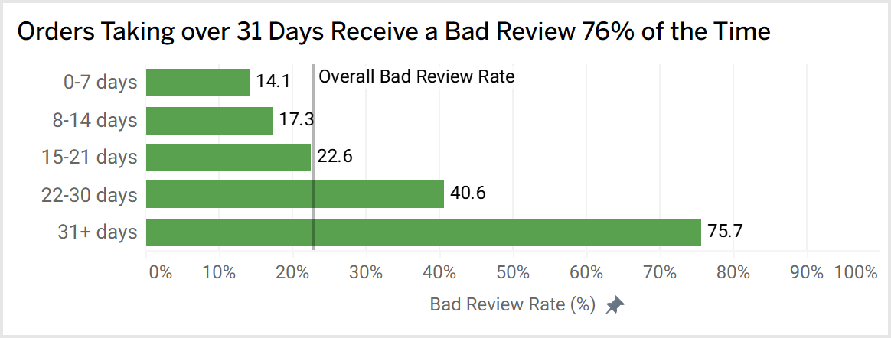
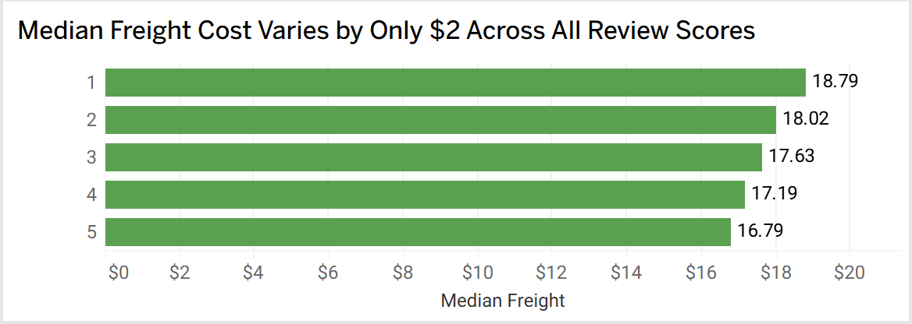
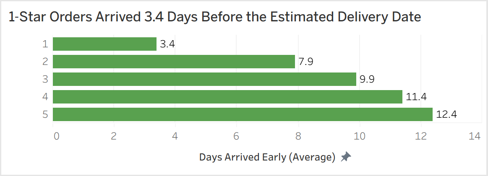
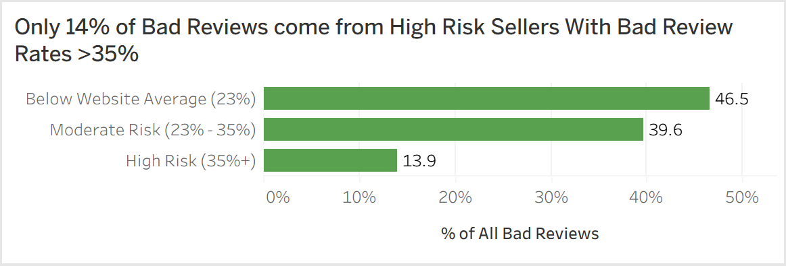
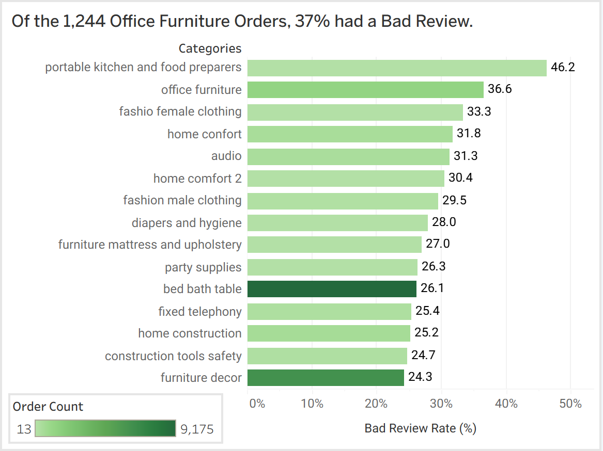
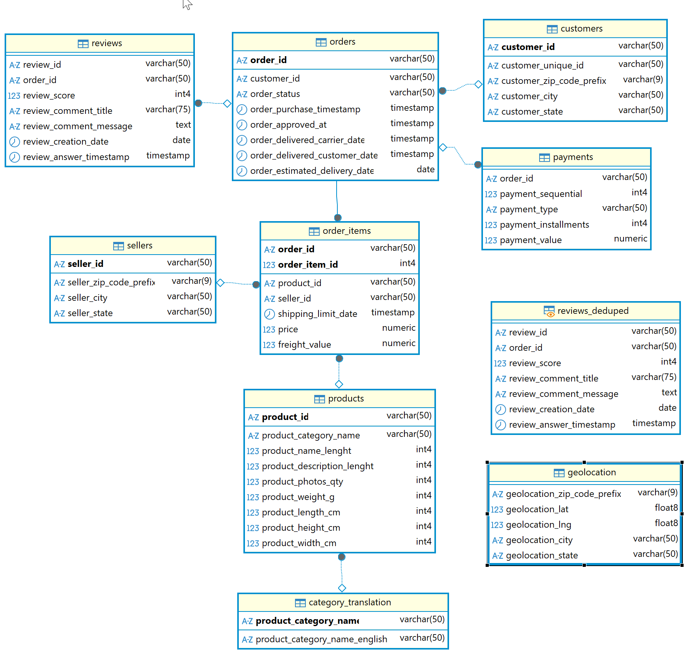

# Olist Brazilian E-Commerce: Customer Satisfaction Analysis

## Problem Statement

What operational factors, such as delivery time, freight cost, and seller behavior, most strongly predict a negative customer experience, and which product categories and sellers represent the highest risk to customer satisfaction?

> A "bad review" is defined as a review score of 1, 2, or 3. These customers are less likely to return making them a churn risk.

---

## Key Findings

- **Delivery time is the dominant driver of bad reviews.** Orders with a score of 1 averaged 20.8 days to deliver versus 10.2 days for orders with a score of 5. Every step up in review score corresponded to a shorter delivery time without exception.

- **Deliveries over 21 days significantly increase risk** Bad review rates rise gradually from 14.1% to 22.6% below that point, then nearly double crossing it, reaching 40.6% for orders taking 22 to 30 days and 75.7% for orders taking 31 or more days.

<p align="center">

</p>

- **Higher freight costs are associated with worse reviews, but delivery time is likely the real reason.** The median freight cost spread across all review scores is only about 2 Brazilian Real. The correlation with bad reviews is likely confounded by delivery time, since bulky products cost more to ship and also take longer to deliver.

<p align="center">

</p>

- **Arriving late relative to the estimate is not the core problem.** Olist pads delivery estimates enough that even the worst-reviewed orders typically arrive 6 days early. Raw delivery time, not relative lateness, drives dissatisfaction. A customer waiting 20 days for their order is unhappy regardless of what the estimate said.

<p align="center">

</p>

**Bad reviews are a platform-wide logistics problem, not a bad seller problem.** Sellers with a bad review rate above 35% account for only 14% of all bad reviews on the platform. The remaining 86% come from sellers at or near the platform average of 23%. Removing every high-risk seller would leave the vast majority of the problem untouched.

<p align="center">

</p>

**Home and furniture categories have the worst bad review rates on the platform.** `office_furniture` has a 36.6% bad review rate across 1,244 orders, nearly double the platform average. `bed_bath_table` is the single largest contributor with 2,398 bad reviews across 9,175 orders. Home comfort, furniture, and mattress categories dominate the top 15 by bad review rate, suggesting something wrong with bulky, hard-to-ship products.

<p align="center">

</p>

---

## Dataset

The Brazilian E-Commerce Public Dataset by Olist is available on [Kaggle](https://www.kaggle.com/datasets/olistbr/brazilian-ecommerce). It contains approximately 100,000 orders from 2016 to 2018 across 9 tables.

| Table | Rows |
|---|---|
| customers | 99,441 |
| orders | 99,441 |
| order_items | 112,650 |
| reviews | 99,224 |
| products | 32,951 |
| sellers | 3,095 |
| payments | 103,886 |
| geolocation | 1,000,163 |
| category_translation | 71 |

**Tools:** PostgreSQL, DBeaver

<p align="center">

</p>

---

## Methodology

### Data Quality Findings

**Reviews table:** `review_id` is not a reliable unique identifier. The same `review_id` appears across multiple `order_id` values with identical comment text, indicating a bug in Olist's review assignment system. Some orders also have multiple reviews with different scores. A `reviews_deduped` view was created using `DISTINCT ON (order_id)` ordered by `review_score ASC`, keeping the most conservative score per order. The view contains 98,673 rows with every `order_id` appearing exactly once.

**Orders table:** 8 orders marked as delivered had no `order_delivered_customer_date` and were excluded. 13 orders had a calculated delivery time of 0 days, likely recording errors, and were also excluded. The final `orders_clean` view contains 96,457 rows.

**Products table:** 610 products had empty string values ("") for `product_category_name`, which were converted to NULL before adding the foreign key constraint. Two categories, `pc_gamer` and `portateis_cozinha_e_preparadores_de_alimentos`, existed in the products table but were missing from `category_translation`. Both were inserted manually with English translations.

### Key Metric Definitions

- **`delivery_days`:** Total days from purchase timestamp to actual delivery. Median: 10 days. Average: 12 days. 90th percentile: 23 days.
- **`delivery_delay_days`:** Days between actual delivery and estimated delivery. Positive means late, negative means early. Median: -11 days, meaning most orders arrived well before the estimated date.

---

## Repository Structure

```
sql/
    01_setup.sql           -- Load reviews CSV, verify row counts, rename tables
    02_data_quality.sql    -- Data quality investigation, fixes, views, and constraints
    03_exploration.sql     -- Distribution checks and all analytical queries
images/                    -- Screenshots of query results
README.md
```

## How to Run

1. Download the dataset from [Kaggle](https://www.kaggle.com/datasets/olistbr/brazilian-ecommerce) and load each CSV into a PostgreSQL database using DBeaver or psql.
2. Update the file path in the `COPY` command in `01_setup.sql` to match your local environment.
3. Run the scripts in order: `01_setup.sql` → `02_data_quality.sql` → `03_exploration.sql`.
4. Note: the data fixes and foreign key constraints in `02_data_quality.sql` must complete before `03_exploration.sql` runs, or the views and analysis queries that depend on clean data will not produce correct results.
