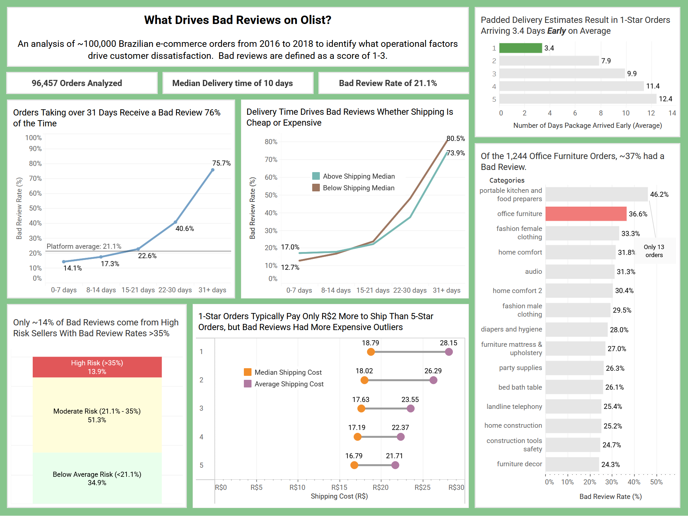
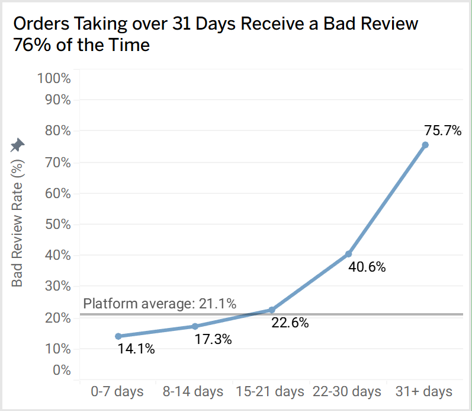
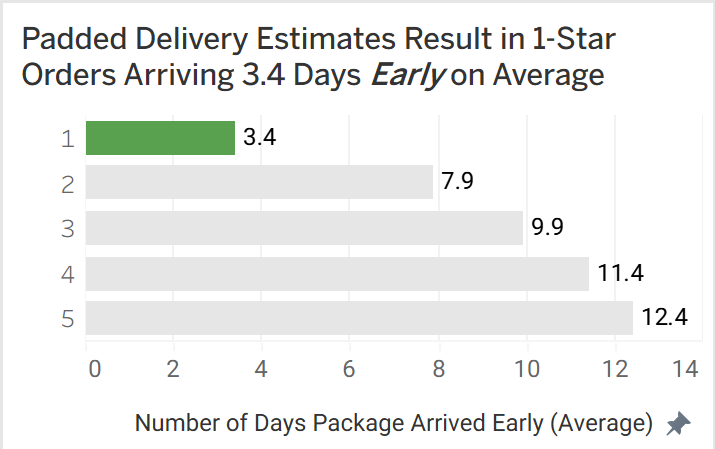
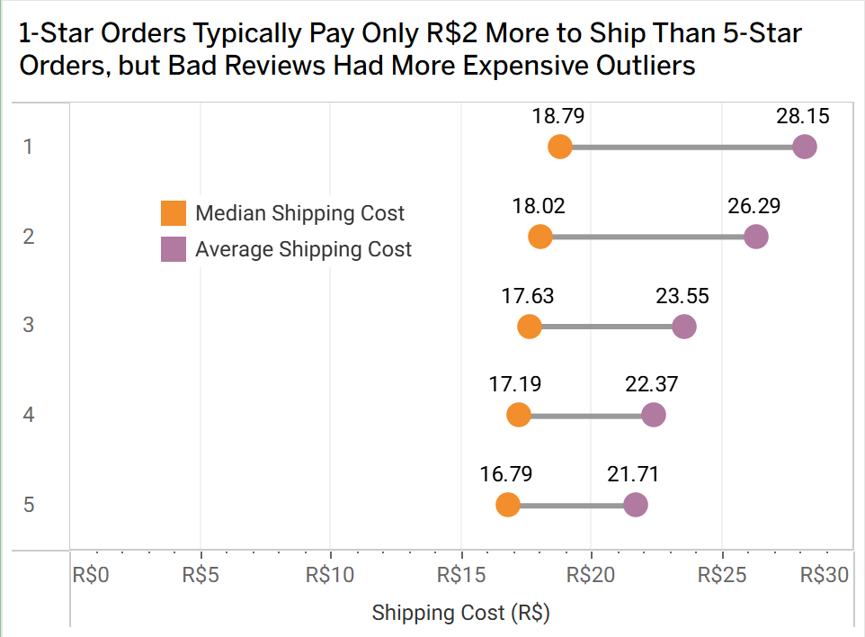
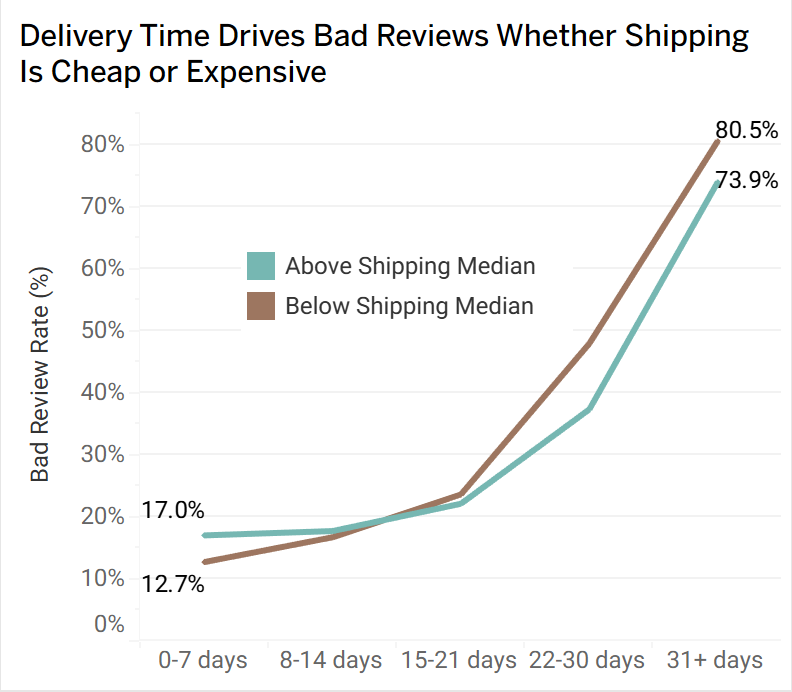
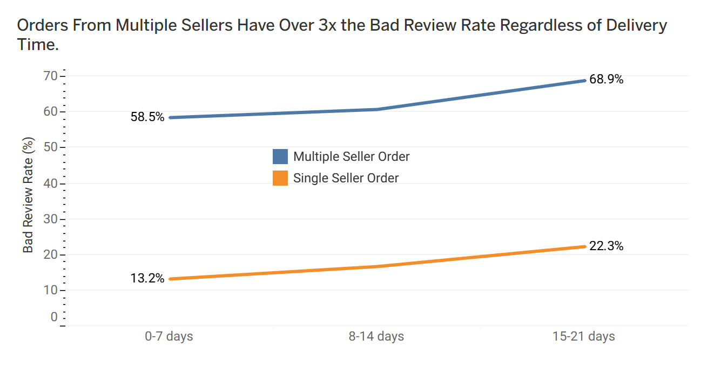
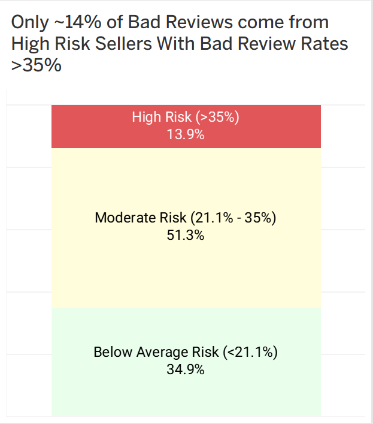
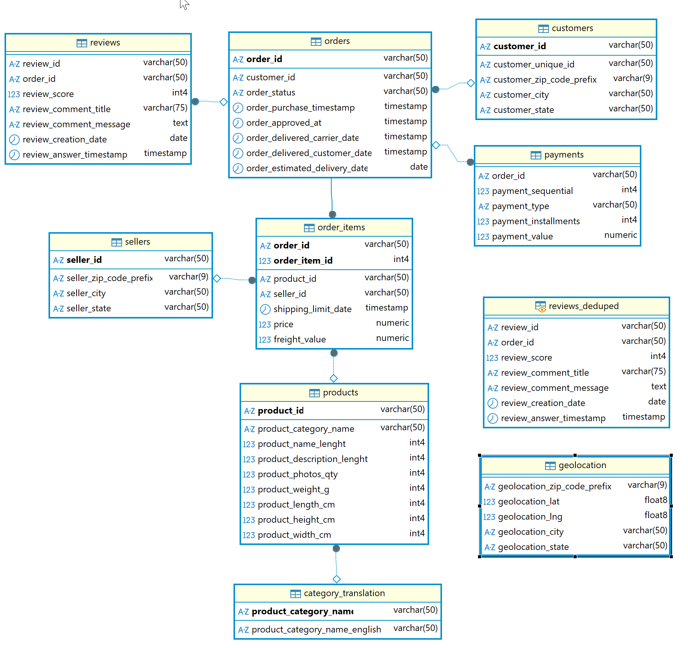

# Olist Brazilian E-Commerce: Customer Satisfaction Analysis

## Problem Statement

What operational factors, such as delivery time, freight cost, and seller behavior, most strongly predict a negative customer experience, and which product categories and sellers represent the highest risk to customer satisfaction?

> A "bad review" is defined as a review score of 1, 2, or 3. These customers are less likely to return making them a churn risk.

---

<p align="center">
  <a href="https://public.tableau.com/views/OlistProjectinTableau/OlistProject_v3?:language=en-US&:sid=&:redirect=auth&:display_count=n&:origin=viz_share_link">
    
  </a>
  <br>
  <a href="https://public.tableau.com/views/OlistProjectinTableau/OlistProject_v3?:language=en-US&:sid=&:redirect=auth&:display_count=n&:origin=viz_share_link">View the Tableau dashboard</a>
</p>

---

## Key Findings

**Delivery time is the dominant driver of bad reviews.** 
- The bad review rate climbs from 14.1% for orders delivered within a week to 75.7% for orders taking over 31 days to arrive. 
- The risk of a bad review nearly doubles from 22.6% to 40.6% if their delivery took over 3 weeks to arrive. 
- Orders rated 1 star took 20.8 days to arrive on average against 10.2 days for 5-star orders, with every step up in review score corresponded to a shorter delivery time without exception.

<p align="center">

</p>

**The problem is the wait itself, not a late delivery.**
- Olist pads its delivery estimates heavily with 93.2% of orders arrive on or before the estimated date.
- Even 1-star orders arrive 3.4 days **early** on average. 
- The longer a customers needs to wait, the greater the chance of a negative review.

<p align="center">

</p>

**Typical orders show a minimal difference in the bad review rate when factoring in shipping costs**
- A difference of only R$2 separate 1-star orders with a median of R$18.79 to R$16.79 for a 5-star order.
- Averages diverge much further at R$28.15 for 1 star and R$21.71 for 5 star orders. The 1 star average in being pulled up by expensive outliers at a higher rate then 5 star orders.

<p align="center">

</p>

**Controlling for delivery time removes the effect.**
- Splitting each delivery time bucket into cheaper and pricier shipping halves, the bad review rate climbs from 12.7% to 80.5% among cheap-shipping orders and from 17.0% to 73.9% among expensive ones.
- Within any single delivery time bucket the shipping gap is small.
- Orders with cheaper shipping overtaking the orders with more epensive shipping as the delivery time increases. 

<p align="center">

</p>

**Orders split across multiple sellers have a bad review rate over 3x worse than single sellers, independent of delivery time.**
- A single order can come from multiple sellers. The same order rating is attributed to all sellers in an order.
- Split orders are 1.3% of all orders, 1,261 in total, and the three buckets shown cover 1,219 of them.
- Among orders delivered within a week, 58.5% of split orders received a bad review against 13.2% of single-seller orders.
- This difference holds at 60.8% against 16.7% for 8-14 days, and 68.9% against 22.3% for 15-21 days.
- Orders taking longer than 21 days have been excluded as they contain only 42 split orders between them, not enough to draw meaningful conclusions
- Olist records a single delivery date per order, so it cannot be ruled out that some customers reviewed after receiving only part of a split order.

<p align="center">

</p>

**Bad reviews are a platform-wide logistics problem, not a bad seller problem.** 
- Sellers with a bad review rate above 35% account for only 13.9% of all bad reviews.
- The remaining 86.1% come from sellers below that threshold and include a large group sitting well above the 21.1% platform average.
- Removing every high-risk seller would leave the majority of the problem unresolved.

<p align="center">

</p>

**Home and furniture categories carry the highest risk.** 
- With over 1.7 times the platform average, `office_furniture` has a 36.6% bad review rate across 1,244 orders
- `bed_bath_table` is the single largest source of bad reviews with 2,398 across 9,175 orders, despite a more moderate 26.1% bad review rate.
- Six of the top 15 categories by rate are home or furniture goods leading. There may be a an issue when it comes to bulky, hard-to-ship products.

<p align="center">

</p>

---

## Dataset

The Brazilian E-Commerce Public Dataset by Olist is available on [Kaggle](https://www.kaggle.com/datasets/olistbr/brazilian-ecommerce). It contains approximately 100,000 orders from 2016 to 2018 across 9 tables.

| Table | Rows |
|---|---|
| customers | 99,441 |
| orders | 99,441 |
| order_items | 112,650 |
| reviews | 99,224 |
| products | 32,951 |
| sellers | 3,095 |
| payments | 103,886 |
| geolocation | 1,000,163 |
| category_translation | 71 |

**Tools:** PostgreSQL, DBeaver

<p align="center">

</p>

---

## Methodology

### Data Quality Findings

**Reviews table:** `review_id` is not a reliable unique identifier. The same `review_id` appears across multiple `order_id` values with identical comment text, indicating a bug in Olist's review assignment system. Some orders also have multiple reviews with different scores. A `reviews_deduped` view was created using `DISTINCT ON (order_id)` ordered by `review_score ASC, review_id`, keeping the most conservative score per order. The `review_id` was added as a tiebreaker due to the fact that 346 orders have two reviews tied on the lowest score. Without it, a third party running the SQL would not have an identical view. Keeping the lowest score rather than the highest or the average moves the platform bad review rate by only 0.11 points, from 21.11% to 21.00%, so the choice does not drive any finding. The view contains 98,673 rows with every `order_id` appearing exactly once.

**Orders table:** 8 orders marked as delivered had no `order_delivered_customer_date` and were excluded. 13 orders had a calculated delivery time of 0 days, likely recording errors, and were also excluded. The final `orders_clean` view contains 96,457 rows.

**Products table:** 610 products had empty string values ("") for `product_category_name`, which were converted to NULL before adding the foreign key constraint. Two categories, `pc_gamer` and `portateis_cozinha_e_preparadores_de_alimentos`, existed in the products table but were missing from `category_translation`. Both were inserted manually with English translations. 

**Category translation table:** Nine English category labels were incorrect or unclear. Seven were corrected: five misspellings (`fashio_female_clothing`, `home_confort`, `costruction_tools_garden`, `costruction_tools_tools`, `arts_and_craftmanship`) and two mistranslations — `seguros_e_servicos` rendered as `security_and_services` when seguros means insurance, and `cds_dvds_musicais` rendered as `cds_dvds_musicals`, the stage genre. 
Two translations were renamed for readability: `cine_photo` to `photography_and_video_equipment`, and `fixed_telephony` to `landline_telephony`. Only the English column was changed as the Portuguese column is the primary key and carries the foreign key from products. 

### Key Metric Definitions

- **`delivery_days`:** Total days from purchase timestamp to actual delivery. Median: 10 days. Average: 12 days. 90th percentile: 23 days.
- **`delivery_delay_days`:** Days between actual delivery and estimated delivery. Positive means late, negative means early. Median: -11 days. Only 6.8% of orders arrived late, so Olist's estimates are consistently conservative.

---

## Repository Structure

```
sql/
    01_setup.sql                  -- Load reviews CSV, verify row counts, rename tables
    02_data_quality.sql           -- Data quality investigation, fixes, views, and constraints
    03_exploration.sql            -- Distribution checks and all analytical queries
images/                           -- Screenshots of query results
csv_exports/					  -- Exported csv files from DBeaver 
Olist Project in Tableau.twbx     -- Packaged Tableau workbook
README.md
```
The Olist dataset CSVs are sourced from [Kaggle](https://www.kaggle.com/datasets/olistbr/brazilian-ecommerce). 

## How to Run

1. Download the dataset from [Kaggle](https://www.kaggle.com/datasets/olistbr/brazilian-ecommerce) and load each CSV into a PostgreSQL database using DBeaver or psql.
2. Update the file path in the `COPY` command in `01_setup.sql` to match your local environment.
3. Run the scripts in order: `01_setup.sql` → `02_data_quality.sql` → `03_exploration.sql`.
4. Note: the data fixes and foreign key constraints in `02_data_quality.sql` must complete before `03_exploration.sql` runs, or the views and analysis queries that depend on clean data will not produce correct results.
